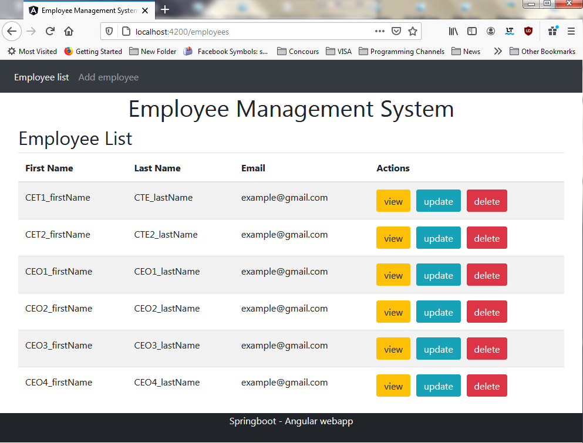
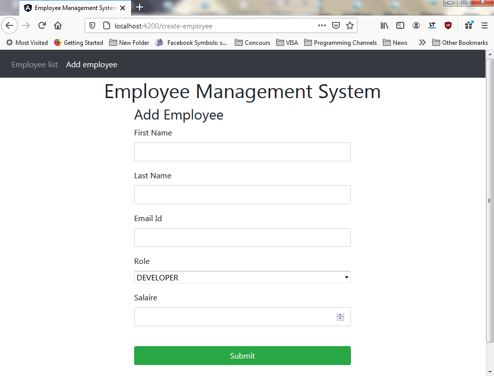

# Employee Management System

| Projet JavaEE |
| ------ |
| Auto-Formation |
| Projet `EmployeeManagementSystem` (v.0.0.1) |
***********************************************************************
## Features
The app helps you manage users, built by Spring Boot for the backend and Angular(TypeScript) for the frontend.

> Note: To use the frontend side, please check it on the URL below :
https://github.com/Ayoub-BL/EmployeeManagementSystem_Frontend_Angular

### Screenshots :

#### List of Employees

#### Add Employee

## Tech
- Angular
- SpringBoot
- Spring JPA (Hibernate)
- Base de données MySQL
- HTML
- ✨Bootstrap✨

## Installation
Run phpMyAdmin and open the application with Elipse IDE and run it
💡 `You don't need to create a database, it will be created automatically 😉`

## Contact
> `boulahya.ayoub@gmail.com`

> `ayoub.boulahya@etu.univ-amu.fr`

## License
**Free Software, Hell Yeah!**